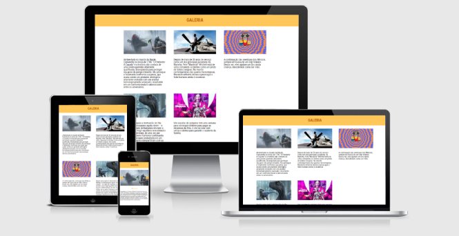

#  Galeria de Fotos

## Abrindo o projeto

Bom você tem duas opções para visualizar o projeto, você pode acessar <a href='https://igo-mgoncalvs.github.io/galeria-de-fotos/' target="_blank">esse link</a> ou você pode baixar este projeto em .zip, ao extrair a pasta abra o git bash (Ou outro interpretador de linha de comando de sua preferencia) digite 'npm i' para que sejam instaladas todos os pacotes usados na aplicação.

## Como desenvolvi a solução

A aplicação em si não é algo tão grande, busquei as imagens e as descrições de uma API publica de filmes e series chamada TMDB, nela eu puxo uma lista de filmes populares e extraio apenas 5 itens. O carrossel funciona aumentando e diminuindo a marginLeft, a cada vez que você clica em alguma das setas adiciona a marginLeft o tamanho exato de cada item.

## 📸 Imagem do site

## 📈 Status
✔ Concluido

## 💻 Tecnologias Utilizadas
- HTML.
- SCSS.
- TypeScript.
- React.

## 🤔 Curiosidades
- Demorei 10hrs pra concluir.
- Minha maior dificuldade foi encontrar uma API legal para usar.
- Não fiz nada tão alem do que eu já conhecia por conta disso decidi treinar minhas habiliades com componentes, pela primeira vez busquei a API com umm componente e distribui por onde eu precisava.
- O site é responivo desenvolvido em mobile first até uma width de 1044px.

## 🔗 Link
Site do projeto: https://igo-mgoncalvs.github.io/galeria-de-fotos/
